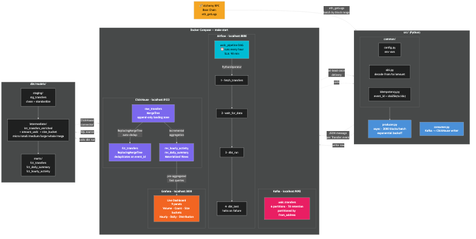

# USDC Payment Pipeline

Production-grade real-time data pipeline monitoring USDC transfers on Base Chain — built with Python, Kafka, ClickHouse, dbt, Airflow, and Grafana.


## Architecture

> 💡 Click the image below to view the full architecture diagram

[](docs/architecture.png)

## Dashboard Preview


## Tech Stack

| Layer | Technology | Purpose |
|---|---|---|
| Ingestion | Python + aiohttp | Async Alchemy RPC fetcher |
| Message Queue | Apache Kafka (Redpanda) | Zookeeper-free streaming |
| Storage | ClickHouse | Columnar OLAP database |
| Transform | dbt | 3-layer SQL transformation |
| Orchestration | Apache Airflow | Hourly DAG with SLA monitoring |
| Visualization | Grafana | 9-panel live dashboard |
| Infrastructure | Docker Compose | 7-service containerized stack |

## Key Features

- Idempotent ingestion using SHA-256 `event_id` (`tx_hash:log_index`)
- At-least-once Kafka delivery with manual offset commits
- `ReplacingMergeTree` deduplication in ClickHouse
- dbt 3-layer model: staging → intermediate → marts
- 14 tests passing with pytest
- 14 days of USDC transfer data: 63K+ events and $15B+ volume

## Pipeline Flow

1. The producer fetches USDC `Transfer` events through Alchemy `eth_getLogs`.
2. Events are published to the `usdc.transfers` Kafka topic across six partitions.
3. The consumer reads from Kafka and writes to ClickHouse `raw_transfers`.
4. dbt transforms raw data through staging and intermediate models into analytical marts.
5. Airflow orchestrates hourly runs with retries and SLA monitoring.
6. Grafana visualizes live metrics from ClickHouse mart tables.

## Quick Start

### Prerequisites

- Docker Desktop running
- Python 3.11+
- An Alchemy API key ([create a free account](https://www.alchemy.com/))

### Setup

```bash
git clone https://github.com/bellatrix-ds/usdc-payment-pipeline
cd usdc-payment-pipeline
cp .env.example .env
# Add your ALCHEMY_BASE_RPC_URL to .env
make start               # starts all 7 Docker services
make init-clickhouse     # creates ClickHouse tables
make generate-historical # loads 14 days of data
make dbt-run             # runs dbt transformations
```

### Access Services

| Service | URL | Credentials |
|---|---|---|
| Grafana | <http://localhost:3000> | admin / admin |
| Airflow | <http://localhost:8081> | admin / admin |
| ClickHouse | <http://localhost:8123> | default / - |
| Redpanda | <http://localhost:9644> | - |

## Project Structure

```text
usdc-payment-pipeline/
├── src/
│   ├── producer.py          # Async Alchemy RPC fetcher
│   ├── consumer.py          # Kafka → ClickHouse writer
│   └── common/              # Shared utilities
├── dbt/models/
│   ├── staging/             # Raw data cleaning
│   ├── intermediate/        # Enrichment (amount_usdc, size_bucket)
│   └── marts/               # Final analytical tables
├── airflow/dags/            # Hourly pipeline DAG
├── dashboards/grafana/      # Dashboard JSON + provisioning
├── sql/clickhouse/          # Schema definitions
├── scripts/                 # Ingestion + backfill scripts
├── tests/                   # 14 pytest unit tests
└── docker-compose.yml       # 7-service stack
```

## Data Model

- **`raw_transfers`** — append-only `MergeTree` landing zone that preserves immutable source events and ingestion metadata.
- **`fct_transfers`** — canonical `ReplacingMergeTree` fact table that deduplicates transfers using the deterministic `event_id`.
- **`mv_hourly_activity` + `mv_daily_summary`** — materialized views that pre-aggregate operational and payment metrics for low-latency dashboard queries.

## Author

**Bella Bahrami — Senior Data Engineer**

- Email: [bellabahramii@gmail.com](mailto:bellabahramii@gmail.com)
- Telegram: [@bella_trickss](https://t.me/bella_trickss)
- GitHub: [bellatrix-ds](https://github.com/bellatrix-ds)

---

Built as a production-oriented data engineering portfolio project focused on reliability, observability, and reproducible analytics.
