# USDC Payment Pipeline

Production-grade real-time data pipeline monitoring USDC transfers on Base Chain - built with Python, Kafka, ClickHouse, dbt, Airflow, and Grafana.


## Architecture

[🔍 View full-screen interactive diagram](https://mermaid.live/edit#base64:Zmxvd2NoYXJ0IExSCgogICAgJSUg4pSA4pSAIEV4dGVybmFsIFNvdXJjZSDilIDilIDilIDilIDilIDilIDilIDilIDilIDilIDilIDilIDilIDilIDilIDilIDilIDilIDilIDilIDilIDilIDilIDilIDilIDilIDilIDilIDilIDilIDilIDilIDilIDilIDilIDilIDilIDilIDilIDilIDilIDilIDilIDilIDilIDilIDilIDilIDilIDilIAKICAgIEFMQ0hFTVlbIvCflJcgQWxjaGVteSBSUENcbkJhc2UgQ2hhaW5cbmV0aF9nZXRMb2dzIl0KCiAgICAlJSDilIDilIAgUHl0aG9uIENvZGUg4pSA4pSA4pSA4pSA4pSA4pSA4pSA4pSA4pSA4pSA4pSA4pSA4pSA4pSA4pSA4pSA4pSA4pSA4pSA4pSA4pSA4pSA4pSA4pSA4pSA4pSA4pSA4pSA4pSA4pSA4pSA4pSA4pSA4pSA4pSA4pSA4pSA4pSA4pSA4pSA4pSA4pSA4pSA4pSA4pSA4pSA4pSA4pSA4pSA4pSA4pSA4pSA4pSA4pSACiAgICBzdWJncmFwaCBTUkNbInNyYy8gIChQeXRob24pIl0KICAgICAgICBkaXJlY3Rpb24gVEIKICAgICAgICBQUk9EWyJwcm9kdWNlci5weVxuYXN5bmMgwrcgMjAwMCBibG9ja3MvYmF0Y2hcbmV4cG9uZW50aWFsIGJhY2tvZmYiXQogICAgICAgIENPTlNbImNvbnN1bWVyLnB5XG5LYWZrYSDihpIgQ2xpY2tIb3VzZSB3cml0ZXIiXQogICAgICAgIHN1YmdyYXBoIENPTU1PTlsiY29tbW9uLyJdCiAgICAgICAgICAgIENPTkZJR1siY29uZmlnLnB5XG5lbnYgdmFycyJdCiAgICAgICAgICAgIEFCSVsiYWJpLnB5XG5kZWNvZGUgZnJvbS90by9hbW91bnQiXQogICAgICAgICAgICBJREVNWyJpZGVtcG90ZW5jeS5weVxuZXZlbnRfaWQgPSBzaGEyNTYodHg6aWR4KSJdCiAgICAgICAgZW5kCiAgICBlbmQKCiAgICAlJSDilIDilIAgRG9ja2VyIFNlcnZpY2VzIOKUgOKUgOKUgOKUgOKUgOKUgOKUgOKUgOKUgOKUgOKUgOKUgOKUgOKUgOKUgOKUgOKUgOKUgOKUgOKUgOKUgOKUgOKUgOKUgOKUgOKUgOKUgOKUgOKUgOKUgOKUgOKUgOKUgOKUgOKUgOKUgOKUgOKUgOKUgOKUgOKUgOKUgOKUgOKUgOKUgOKUgOKUgOKUgOKUgOKUgAogICAgc3ViZ3JhcGggRE9DS0VSWyJEb2NrZXIgQ29tcG9zZSAg4oCUIG1ha2Ugc3RhcnQiXQogICAgICAgIGRpcmVjdGlvbiBUQgoKICAgICAgICBzdWJncmFwaCBLRlsiS2Fma2EgwrcgbG9jYWxob3N0OjkwOTIiXQogICAgICAgICAgICBUT1BJQ1sidXNkYy50cmFuc2ZlcnNcbjYgcGFydGl0aW9ucyDCtyA3ZCByZXRlbnRpb25cbnBhcnRpdGlvbmVkIGJ5IGZyb21fYWRkcmVzcyJdCiAgICAgICAgZW5kCgogICAgICAgIHN1YmdyYXBoIENIWyJDbGlja0hvdXNlIMK3IGxvY2FsaG9zdDo4MTIzIl0KICAgICAgICAgICAgUkFXWyJyYXdfdHJhbnNmZXJzXG5NZXJnZVRyZWVcbmFwcGVuZC1vbmx5IGxhbmRpbmcgem9uZSJdCiAgICAgICAgICAgIEZDVF9DSFsiZmN0X3RyYW5zZmVyc1xuUmVwbGFjaW5nTWVyZ2VUcmVlXG5kZWR1cGxpY2F0ZXMgb24gZXZlbnRfaWQiXQogICAgICAgICAgICBNVlsibXZfaG91cmx5X2FjdGl2aXR5XG5tdl9kYWlseV9zdW1tYXJ5XG5NYXRlcmlhbGl6ZWQgVmlld3MiXQogICAgICAgIGVuZAoKICAgICAgICBzdWJncmFwaCBBRlsiQWlyZmxvdyDCtyBsb2NhbGhvc3Q6ODA4MCJdCiAgICAgICAgICAgIERBR1sidXNkY19waXBlbGluZSBEQUdcbuKPsCBydW5zIGV2ZXJ5IGhvdXJcblNMQTogOTAgbWluIl0KICAgICAgICAgICAgVDFbIjHCtyBmZXRjaF90cmFuc2ZlcnMiXQogICAgICAgICAgICBUMlsiMsK3IHdhaXRfZm9yX2RhdGEiXQogICAgICAgICAgICBUM1siM8K3IGRidF9ydW4iXQogICAgICAgICAgICBUNFsiNMK3IGRidF90ZXN0XG5oYWx0cyBvbiBmYWlsdXJlIl0KICAgICAgICAgICAgVDEgLS0-IFQyIC0tPiBUMyAtLT4gVDQKICAgICAgICBlbmQKCiAgICAgICAgc3ViZ3JhcGggR0ZbIkdyYWZhbmEgwrcgbG9jYWxob3N0OjMwMDAiXQogICAgICAgICAgICBEQVNIWyJMaXZlIERhc2hib2FyZFxuOSBwYW5lbHNcblZvbHVtZSDCtyBDb3VudCDCtyBTaXplIGJ1Y2tldHNcbkhvdXJseSDCtyBEYWlseSDCtyBEaXN0cmlidXRpb24iXQogICAgICAgIGVuZAogICAgZW5kCgogICAgJSUg4pSA4pSAIGRidCDilIDilIDilIDilIDilIDilIDilIDilIDilIDilIDilIDilIDilIDilIDilIDilIDilIDilIDilIDilIDilIDilIDilIDilIDilIDilIDilIDilIDilIDilIDilIDilIDilIDilIDilIDilIDilIDilIDilIDilIDilIDilIDilIDilIDilIDilIDilIDilIDilIDilIDilIDilIDilIDilIDilIDilIDilIDilIDilIDilIDilIDilIAKICAgIHN1YmdyYXBoIERCVFsiZGJ0L21vZGVscy8iXQogICAgICAgIGRpcmVjdGlvbiBUQgogICAgICAgIFNUR1sic3RhZ2luZy9cbnN0Z190cmFuc2ZlcnNcbmNsZWFuICsgc3RhbmRhcmRpemUiXQogICAgICAgIElOVFsiaW50ZXJtZWRpYXRlL1xuaW50X3RyYW5zZmVyc19lbnJpY2hlZFxuKyBhbW91bnRfdXNkYyAgKyBzaXplX2J1Y2tldFxubWljcm8vc21hbGwvbWVkaXVtL2xhcmdlL3doYWxlL21lZ2EiXQogICAgICAgIE1BUlRbIm1hcnRzL1xuZmN0X3RyYW5zZmVyc1xuZmN0X2RhaWx5X3N1bW1hcnlcbmZjdF9ob3VybHlfYWN0aXZpdHkiXQogICAgZW5kCgogICAgJSUg4pSA4pSAIERhdGEgRmxvdyDilIDilIDilIDilIDilIDilIDilIDilIDilIDilIDilIDilIDilIDilIDilIDilIDilIDilIDilIDilIDilIDilIDilIDilIDilIDilIDilIDilIDilIDilIDilIDilIDilIDilIDilIDilIDilIDilIDilIDilIDilIDilIDilIDilIDilIDilIDilIDilIDilIDilIDilIDilIDilIDilIDilIDilIAKICAgIEFMQ0hFTVkgLS0-fCJldGhfZ2V0TG9nc1xuYmF0Y2ggYnkgYmxvY2sgcmFuZ2UifCBQUk9ECiAgICBDT01NT04gLS0-IFBST0QKICAgIFBST0QgLS0-fCJKU09OIG1lc3NhZ2VcbnBlciBUcmFuc2ZlciBldmVudCJ8IFRPUElDCiAgICBUT1BJQyAtLT58ImF0LWxlYXN0LW9uY2VcbmRlbGl2ZXJ5InwgQ09OUwogICAgQ09OUyAtLT58IndyaXRlIHJvdyJ8IFJBVwogICAgUkFXIC0tPnwiUmVwbGFjaW5nTWVyZ2VUcmVlXG5hdXRvLWRlZHVwInwgRkNUX0NICiAgICBSQVcgLS0-fCJpbmNyZW1lbnRhbFxuYWdncmVnYXRpb24ifCBNVgogICAgRkNUX0NIIC0tPnwiU1FMIHNvdXJjZSJ8IFNURwogICAgU1RHIC0tPiBJTlQKICAgIElOVCAtLT4gTUFSVAogICAgTUFSVCAtLT58IkNsaWNrSG91c2VcbmNvbm5lY3RvciJ8IERBU0gKICAgIE1WIC0tPnwicHJlLWFnZ3JlZ2F0ZWRcbmZhc3QgcXVlcmllcyJ8IERBU0gKICAgIERBRyAtLT58IlB5dGhvbk9wZXJhdG9yInwgVDEKICAgIFQxIC0uLT58ImNhbGxzInwgUFJPRAogICAgVDMgLS4tPnwiY2FsbHMgZGJ0IHJ1biJ8IFNURwoKICAgICUlIOKUgOKUgCBTdHlsaW5nIOKUgOKUgOKUgOKUgOKUgOKUgOKUgOKUgOKUgOKUgOKUgOKUgOKUgOKUgOKUgOKUgOKUgOKUgOKUgOKUgOKUgOKUgOKUgOKUgOKUgOKUgOKUgOKUgOKUgOKUgOKUgOKUgOKUgOKUgOKUgOKUgOKUgOKUgOKUgOKUgOKUgOKUgOKUgOKUgOKUgOKUgOKUgOKUgOKUgOKUgOKUgOKUgOKUgOKUgOKUgOKUgOKUgOKUgAogICAgc3R5bGUgQUxDSEVNWSBmaWxsOiNmNWE2MjMsY29sb3I6IzAwMAogICAgc3R5bGUgUFJPRCBmaWxsOiM0YTkwZDksY29sb3I6I2ZmZgogICAgc3R5bGUgQ09OUyBmaWxsOiM0YTkwZDksY29sb3I6I2ZmZgogICAgc3R5bGUgVE9QSUMgZmlsbDojZTkxZTYzLGNvbG9yOiNmZmYKICAgIHN0eWxlIFJBVyBmaWxsOiM3YjY4ZWUsY29sb3I6I2ZmZgogICAgc3R5bGUgRkNUX0NIIGZpbGw6IzdiNjhlZSxjb2xvcjojZmZmCiAgICBzdHlsZSBNViBmaWxsOiM3YjY4ZWUsY29sb3I6I2ZmZgogICAgc3R5bGUgREFTSCBmaWxsOiNmMjY1MjIsY29sb3I6I2ZmZgogICAgc3R5bGUgREFHIGZpbGw6IzAwYmNkNCxjb2xvcjojMDAwCg==)

```mermaid
flowchart LR

    %% ── External Source ──────────────────────────────────────────────────
    ALCHEMY["🔗 Alchemy RPC\nBase Chain\neth_getLogs"]

    %% ── Python Code ──────────────────────────────────────────────────────
    subgraph SRC["src/  (Python)"]
        direction TB
        PROD["producer.py\nasync · 2000 blocks/batch\nexponential backoff"]
        CONS["consumer.py\nKafka → ClickHouse writer"]
        subgraph COMMON["common/"]
            CONFIG["config.py\nenv vars"]
            ABI["abi.py\ndecode from/to/amount"]
            IDEM["idempotency.py\nevent_id = sha256(tx:idx)"]
        end
    end

    %% ── Docker Services ──────────────────────────────────────────────────
    subgraph DOCKER["Docker Compose  — make start"]
        direction TB

        subgraph KF["Kafka · localhost:9092"]
            TOPIC["usdc.transfers\n6 partitions · 7d retention\npartitioned by from_address"]
        end

        subgraph CH["ClickHouse · localhost:8123"]
            RAW["raw_transfers\nMergeTree\nappend-only landing zone"]
            FCT_CH["fct_transfers\nReplacingMergeTree\ndeduplicates on event_id"]
            MV["mv_hourly_activity\nmv_daily_summary\nMaterialized Views"]
        end

        subgraph AF["Airflow · localhost:8080"]
            DAG["usdc_pipeline DAG\n⏰ runs every hour\nSLA: 90 min"]
            T1["1· fetch_transfers"]
            T2["2· wait_for_data"]
            T3["3· dbt_run"]
            T4["4· dbt_test\nhalts on failure"]
            T1 --> T2 --> T3 --> T4
        end

        subgraph GF["Grafana · localhost:3000"]
            DASH["Live Dashboard\n9 panels\nVolume · Count · Size buckets\nHourly · Daily · Distribution"]
        end
    end

    %% ── dbt ──────────────────────────────────────────────────────────────
    subgraph DBT["dbt/models/"]
        direction TB
        STG["staging/\nstg_transfers\nclean + standardize"]
        INT["intermediate/\nint_transfers_enriched\n+ amount_usdc  + size_bucket\nmicro/small/medium/large/whale/mega"]
        MART["marts/\nfct_transfers\nfct_daily_summary\nfct_hourly_activity"]
    end

    %% ── Data Flow ────────────────────────────────────────────────────────
    ALCHEMY -->|"eth_getLogs\nbatch by block range"| PROD
    COMMON --> PROD
    PROD -->|"JSON message\nper Transfer event"| TOPIC
    TOPIC -->|"at-least-once\ndelivery"| CONS
    CONS -->|"write row"| RAW
    RAW -->|"ReplacingMergeTree\nauto-dedup"| FCT_CH
    RAW -->|"incremental\naggregation"| MV
    FCT_CH -->|"SQL source"| STG
    STG --> INT
    INT --> MART
    MART -->|"ClickHouse\nconnector"| DASH
    MV -->|"pre-aggregated\nfast queries"| DASH
    DAG -->|"PythonOperator"| T1
    T1 -.->|"calls"| PROD
    T3 -.->|"calls dbt run"| STG

    %% ── Styling ──────────────────────────────────────────────────────────
    style ALCHEMY fill:#f5a623,color:#000
    style PROD fill:#4a90d9,color:#fff
    style CONS fill:#4a90d9,color:#fff
    style TOPIC fill:#e91e63,color:#fff
    style RAW fill:#7b68ee,color:#fff
    style FCT_CH fill:#7b68ee,color:#fff
    style MV fill:#7b68ee,color:#fff
    style DASH fill:#f26522,color:#fff
    style DAG fill:#00bcd4,color:#000
```



## Dashboard Preview


## Tech Stack

| Layer | Technology | Purpose |
|---|---|---|
| Ingestion | Python + aiohttp | Async Alchemy RPC fetcher |
| Message Queue | Apache Kafka (Redpanda) | Zookeeper-free streaming |
| Storage | ClickHouse | Columnar OLAP database |
| Transform | dbt | 3-layer SQL transformation |
| Orchestration | Apache Airflow | Hourly DAG with SLA monitoring |
| Visualization | Grafana | 9-panel live dashboard |
| Infrastructure | Docker Compose | 7-service containerized stack |

## Key Features

- Idempotent ingestion using SHA-256 `event_id` (`tx_hash:log_index`)
- At-least-once Kafka delivery with manual offset commits
- `ReplacingMergeTree` deduplication in ClickHouse
- dbt 3-layer model: staging → intermediate → marts
- 14 tests passing with pytest
- 14 days of USDC transfer data: 63K+ events and $15B+ volume

## Pipeline Flow

1. The producer fetches USDC `Transfer` events through Alchemy `eth_getLogs`.
2. Events are published to the `usdc.transfers` Kafka topic across six partitions.
3. The consumer reads from Kafka and writes to ClickHouse `raw_transfers`.
4. dbt transforms raw data through staging and intermediate models into analytical marts.
5. Airflow orchestrates hourly runs with retries and SLA monitoring.
6. Grafana visualizes live metrics from ClickHouse mart tables.

## Quick Start

### Prerequisites

- Docker Desktop running
- Python 3.11+
- An Alchemy API key ([create a free account](https://www.alchemy.com/))

### Setup

```bash
git clone https://github.com/bellatrix-ds/usdc-payment-pipeline
cd usdc-payment-pipeline
cp .env.example .env
# Add your ALCHEMY_BASE_RPC_URL to .env
make start               # starts all 7 Docker services
make init-clickhouse     # creates ClickHouse tables
make generate-historical # loads 14 days of data
make dbt-run             # runs dbt transformations
```

### Access Services

| Service | URL | Credentials |
|---|---|---|
| Grafana | <http://localhost:3000> | admin / admin |
| Airflow | <http://localhost:8081> | admin / admin |
| ClickHouse | <http://localhost:8123> | default / - |
| Redpanda | <http://localhost:9644> | - |

## Project Structure

```text
usdc-payment-pipeline/
├── src/
│   ├── producer.py          # Async Alchemy RPC fetcher
│   ├── consumer.py          # Kafka → ClickHouse writer
│   └── common/              # Shared utilities
├── dbt/models/
│   ├── staging/             # Raw data cleaning
│   ├── intermediate/        # Enrichment (amount_usdc, size_bucket)
│   └── marts/               # Final analytical tables
├── airflow/dags/            # Hourly pipeline DAG
├── dashboards/grafana/      # Dashboard JSON + provisioning
├── sql/clickhouse/          # Schema definitions
├── scripts/                 # Ingestion + backfill scripts
├── tests/                   # 14 pytest unit tests
└── docker-compose.yml       # 7-service stack
```

## Data Model

- **`raw_transfers`** - append-only `MergeTree` landing zone that preserves immutable source events and ingestion metadata.
- **`fct_transfers`** - canonical `ReplacingMergeTree` fact table that deduplicates transfers using the deterministic `event_id`.
- **`mv_hourly_activity` + `mv_daily_summary`** - materialized views that pre-aggregate operational and payment metrics for low-latency dashboard queries.

## Author

**Bella Bahrami: Senior Data Engineer**

- Email: [bellabahramii@gmail.com](mailto:bellabahramii@gmail.com)
- Telegram: [@bella_trickss](https://t.me/bella_trickss)
- GitHub: [bellatrix-ds](https://github.com/bellatrix-ds)

---

Built as a production-oriented data engineering portfolio project focused on reliability, observability, and reproducible analytics.
